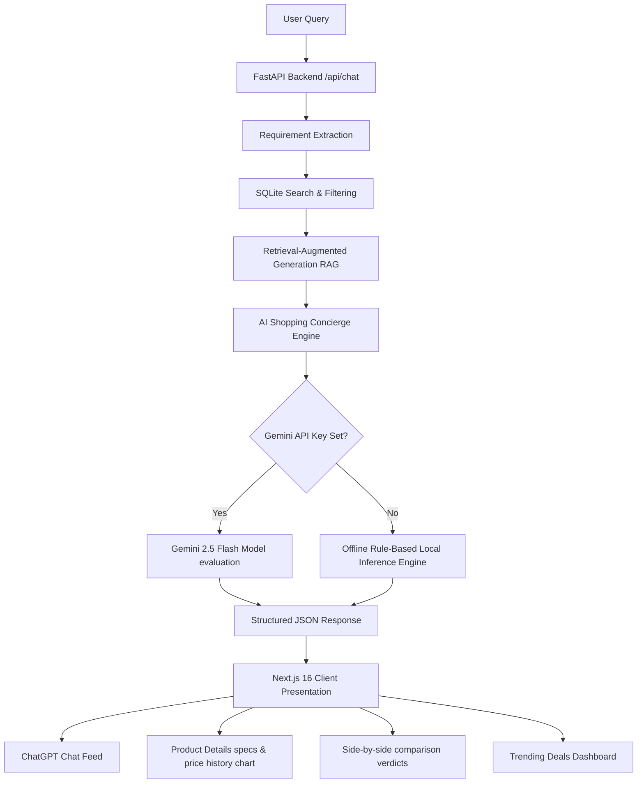

# DEALZ - Your Personal AI Shopping Concierge

DEALZ is an agentic shopping assistant designed to help users make smarter purchasing decisions. Instead of listing generic price comparison charts, DEALZ behaves like a dedicated AI agent that extracts search constraints from natural language queries, aggregates local database specifications, analyzes customer sentiment, scores deal values out of 10, suggests alternatives with trade-offs, and advises whether to buy immediately or wait based on price histories.

---

## 🏗️ Architecture & Core Agent Workflow



### Core Workflow Components
1. **Requirement Extraction:** Extracts target category, numeric budget threshold, feature preferences, and package elements.
2. **Product Search & Filtering:** Performs structured SQLite queries matching keywords, category filters, and price ranges.
3. **AI Concierge Engine:**
   - **Deal Score:** Computes a 1-to-10 rating scale based on user ratings, historical pricing competitiveness, and sentiment analysis ratio.
   - **Review Summarizer:** Synthesizes key pros, cons, target consumer profiles, and common product complaints from the review database.
   - **Trade-Off & Alternatives Matrix:** Explains why the selected item matches best, and contrasts alternatives.
   - **Price trend forecasting:** Yields a `BUY NOW` or `WAIT` recommendation based on historical price curves.

---

## 🛠️ Tech Stack
- **Frontend:** Next.js (App Router, TypeScript), Tailwind CSS v4, Lucide React Icons
- **Backend:** Python 3.13, FastAPI, SQLite3 Database
- **AI Model:** Google Gemini API (`gemini-2.5-flash`) with structured offline fallback mode.

---

## 🚀 Setup & Execution Instructions

Follow these steps to spin up the application on your local machine:

### 1. Run the Backend API Server
1. Navigate to the `backend` folder:
   ```bash
   cd backend
   ```
2. Create and configure your `.env` configuration (optional: add your Google Gemini key):
   ```bash
   copy .env.example .env
   ```
3. Initialize the Python virtual environment and install packages:
   ```bash
   python -m venv venv
   .\venv\Scripts\activate
   pip install -r requirements.txt
   ```
4. Start the FastAPI server (autogenerates the SQLite DB and seeds data on startup):
   ```bash
   python app/main.py
   ```
   *The backend will boot up at `http://127.0.0.1:8000`.*

### 2. Run the Next.js Frontend
1. Open a new terminal tab/window and navigate to the `frontend` folder:
   ```bash
   cd frontend
   ```
2. Install npm dependencies:
   ```bash
   npm install
   ```
3. Run the Next.js development server:
   ```bash
   npm run dev
   ```
   *The frontend application will boot up at `http://localhost:3000`.*

---

## 🔌 API Documentation

All request payloads are JSON and endpoints allow cross-origin requests.

### 1. AI Chat Endpoint
- **URL:** `POST /api/chat`
- **Request Body:**
  ```json
  {
    "message": "laptop under 70k for coding",
    "history": [
      { "role": "user", "content": "hi" },
      { "role": "assistant", "content": "Hello, how can I help you shop today?" }
    ]
  }
  ```
- **Response Shape:** Includes a conversational message (`response_text`), category, extracted budget, lists of primary products, trade-off alternatives, and setup parameters (if a workspace setup was requested).

### 2. Compare Products
- **URL:** `POST /api/compare`
- **Request Body:**
  ```json
  {
    "product_ids": ["laptop-3", "laptop-5"]
  }
  ```
- **Response Shape:** Returns matching products side by side, review summaries (pros/cons), a comparison verdict, and declares the absolute "winner" ID based on deal parameters.

### 3. Product Catalog & Details
- **URL:** `GET /api/products` (Filters: `category`, `query`, `min_price`, `max_price`, `brand`)
- **URL:** `GET /api/products/{id}` (Returns spec sheets, raw customer comments, and buy/wait indicators)

### 4. Workspace Setup Builder
- **URL:** `POST /api/goal-setup`
- **Request Body:**
  ```json
  {
    "query": "coding and gaming workspace",
    "budget": 100000
  }
  ```
- **Response Shape:** Selects a cohesive combination of exactly four items (Laptop, Monitor, Keyboard, Mouse) totaling $\le$ the budget, including package scoring and rationale.

---

## ⚡ Smart Offline Fallback Mode
If no `GEMINI_API_KEY` is supplied in the backend configuration, DEALZ activates its regex-driven heuristics parser. It extracts numbers and category tags from inputs, searches products, ranks them using a deterministic Deal Score equation, analyzes review sentiment ratios, selects budget setup items, and prints formatted markdown responses. This ensures that developer verification and client testing run **flawlessly** out-of-the-box without requiring API credentials.
